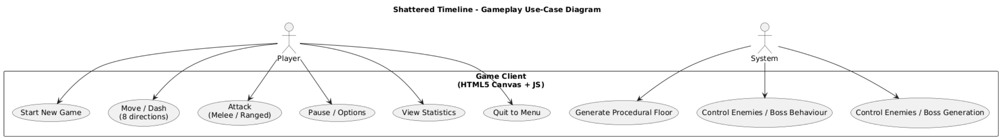
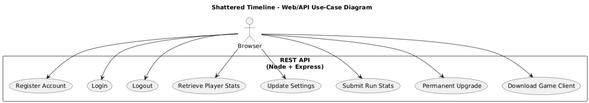
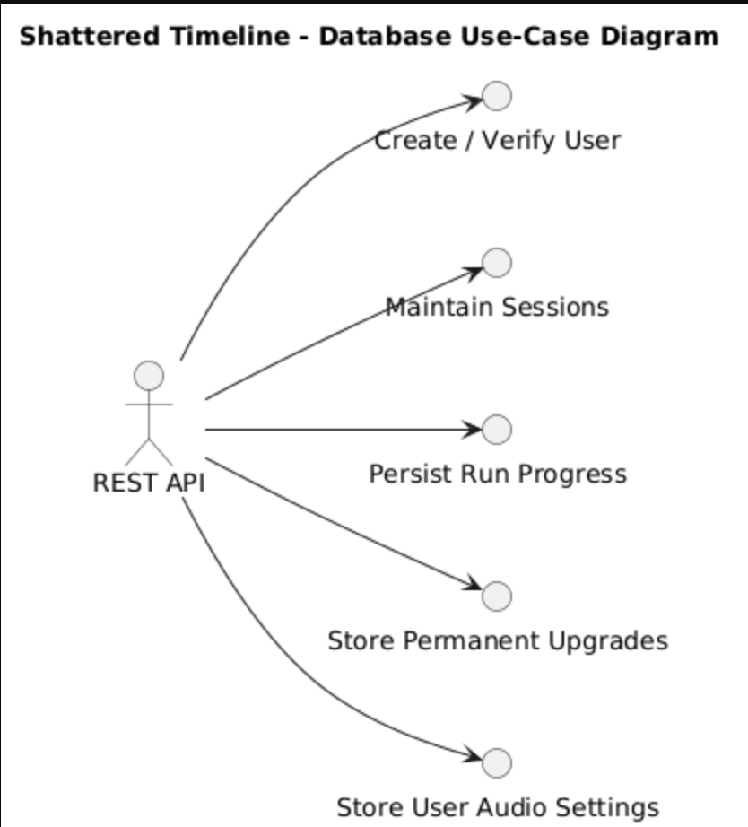

# 🎮 Shattered Timeline – Use Case Diagrams

This document presents the core system architecture of **Shattered Timeline**, a top-down roguelite built in JavaScript and served via a Node.js REST API. The system is described using three layered **use case diagrams** representing the:

1. **Gameplay Layer** – real-time in-browser interactions.
2. **Web/API Layer** – communication between the browser and backend.
3. **Database Layer** – backend persistence and data management.

These diagrams identify key actors, responsibilities, and flows across the game's full stack, from player inputs to long-term data storage.

---

## 1. 🎮 Gameplay Use-Case Diagram

### 🧩 System: Game Client (HTML5 + JavaScript)

This layer defines how the **player** interacts with the game during active gameplay, and how the internal **System** actor (representing game logic) governs automated behaviors.

#### 👤 Actors:
- **Player**: The user controlling the character, making decisions, and navigating the game world.
- **System**: The autonomous engine responsible for generating content, controlling enemies, and responding to progression triggers.

#### 🔧 Use Cases:

**Player:**
- **Start New Game** – Initiates a new session from the main menu.
- **Move / Dash (8 directions)** – Enables free directional control and evasive movement.
- **Attack (Melee / Ranged)** – Engages enemies using equipped weapons.
- **Pause / Options** – Opens in-game menu for configuration or break.
- **View Statistics** – Displays metrics such as runs completed, enemies defeated, or upgrades unlocked.
- **Quit to Menu** – Exits the current run and returns to the main interface.

**System:**
- **Generate Procedural Floor** – Dynamically builds floor layouts and room content based on rules and randomness.
- **Control Enemies / Boss Behaviour** – Handles enemy and boss AI including movement, targeting, and attack patterns.
- **Control Enemies / Boss Generation** – Spawns enemy and boss entities based on the player’s progression and environment.

---

## 2. 🌐 Web/API Use-Case Diagram

### 🧩 System: REST API (Node.js + Express)

This layer represents the interaction between the **Browser** (game frontend) and the server. It manages player authentication, data synchronization, and access to game configuration or assets.

#### 👤 Actor:
- **Browser**: The frontend client running on the player's device, responsible for sending requests to the server and rendering responses in real time.

#### 🔧 Use Cases:
- **Register Account** – Creates a new user account with credentials.
- **Login** – Authenticates a user and returns a JWT for session tracking.
- **Logout** – Terminates an active session or invalidates the token.
- **Retrieve Player Stats** – Fetches user-specific statistics and metadata.
- **Update Settings** – Saves personalized game settings like audio levels or controls.
- **Submit Run Stats** – Sends a summary of a completed or interrupted run for database persistence.
- **Get Permanent Upgrade** – Requests a server-side upgrade tied to the player’s account (e.g., HP, damage).
- **Download Game Client** – Loads the static frontend assets (HTML, JS, CSS, sprites, music) into the browser to launch the game.

---

## 3. 🗄️ Database Use-Case Diagram

### 🧩 System: MySQL Database (`dbshatteredtimeline`)

This layer defines the operations managed by the **REST API** to ensure long-term storage of all essential user data and gameplay records.

#### 👤 Actor:
- **REST API**: The backend server logic that communicates with the MySQL database and mediates between the browser and stored data.

#### 🔧 Use Cases:
- **Create / Verify User** – Inserts new user records or validates existing credentials during login.
- **Maintain Sessions** – Manages active sessions or token lifecycles for user security.
- **Persist Run Progress** – Stores each game run’s outcome (floors cleared, enemies killed, rewards obtained).
- **Store Permanent Upgrades** – Records long-term unlocks that affect future runs.
- **Store User Audio Settings** – Persists per-user audio preferences like music and SFX volume.

---

## 🔄 System Layer Summary

| Layer       | Technology         | Actor(s)        | Responsibilities                                                                 |
|-------------|--------------------|-----------------|----------------------------------------------------------------------------------|
| Gameplay    | HTML5 + JavaScript | Player, System  | Real-time controls, procedural generation, in-game logic                         |
| Web/API     | Node.js + Express  | Browser         | Account creation, login, data syncing, settings updates, frontend delivery       |
| Database    | MySQL              | REST API        | User authentication, run tracking, upgrade storage, persistent configurations    |

---

